# Bem-vindo ao IonKod Portfolio

Este projeto é um portfólio desenvolvido em Java e Spring Boot, demonstrando as habilidades e experiências do desenvolvedor.

## Estrutura do Projeto

```mermaid
graph TD;
    A[application.properties.html]
    B[com]
    C[index.html]
    D[ionkod]
    E[index.html]
    F[portfolio]
    G[index.html]
    H[PortfolioApplication.java.html]
    I[PortfolioApplicationTests.java.html]
    J[Dockerfile]
    K[HELP.md]
    L[index.html]
    M[mvnw]
    N[mvnw.cmd]
    O[pom.xml]
    P[Procfile]
    Q[src]
    R[main]
    S[java]
    T[com]
    U[ionkod]
    V[portfolio]
    W[HomeController.java]
    X[PortfolioApplication.java]
    Y[resources]
    Z[application.properties]
    AA[static]
    AB[css]
    AC[style.css]
    AD[templates]
    AE[index.html]
    AF[test]
    AG[java]
    AH[com]
    AI[ionkod]
    AJ[portfolio]
    AK[PortfolioApplicationTests.java]
    AL[static]
    AM[target]
    AN[classes]
    AO[application.properties]
    AP[com]
    AQ[ionkod]
    AR[portfolio]
    AS[HomeController.class]
    AT[PortfolioApplication.class]
    AU[static]
    AV[css]
    AW[style.css]
    AX[templates]
    AY[index.html]
    AZ[generated-sources]
    BA[annotations]
    BB[generated-test-sources]
    BC[test-annotations]
    BD[maven-archiver]
    BE[pom.properties]
    BF[maven-status]
    BG[maven-compiler-plugin]
    BH[compile]
    BI[default-compile]
    BJ[createdFiles.lst]
    BK[inputFiles.lst]
    BL[testCompile]
    BM[default-testCompile]
    BN[createdFiles.lst]
    BO[inputFiles.lst]
    BP[portfolio-0.0.1-SNAPSHOT.jar]
    BQ[portfolio-0.0.1-SNAPSHOT.jar.original]
    BR[surefire-reports]
    BS[com.ionkod.portfolio.PortfolioApplicationTests.txt]
    BT[TEST-com.ionkod.portfolio.PortfolioApplicationTests.xml]
    BU[test-classes]
    BV[com]
    BW[ionkod]
    BX[portfolio]
    BY[PortfolioApplicationTests.class]
    B --> C;
    B --> D;
    B --> J;
    B --> K;
    B --> L;
    B --> M;
    B --> N;
    B --> O;
    B --> P;
    B --> Q;
    Q --> R;
    R --> S;
    S --> T;
    T --> U;
    U --> V;
    V --> W;
    V --> X;
    Y --> Z;
    Y --> AA;
    Y --> AB;
    AA --> AC;
    Q --> AF;
    AF --> AG;
    AG --> AH;
    AH --> AI;
    AI --> AJ;
    AJ --> AK;
    AM --> AN;
    AN --> AO;
    AO --> AP;
    AP --> AQ;
    AQ --> AR;
    AR --> AS;
    AN --> AU;
    AU --> AV;
    AV --> AW;
    AX --> AY;
    AZ --> BA;
    BA --> BB;
    AZ --> BD;
    BD --> BE;
    BE --> BF;
    BF --> BG;
    BG --> BH;
    BH --> BI;
    BI --> BJ;
    BI --> BK;
    BJ --> BL;
    BM --> BN;
    BO --> BP;
    BQ --> BR;
    BR --> BS;
    BR --> BT;
    BU --> BV;
    BV --> BW;
    BW --> BX;
    BX --> BY;
```


```markdow
├── application.properties.html
├── com
│   ├── index.html
│   └── ionkod
│       ├── index.html
│       └── portfolio
│           ├── index.html
│           ├── PortfolioApplication.java.html
│           └── PortfolioApplicationTests.java.html
├── Dockerfile
├── HELP.md
├── index.html
├── mvnw
├── mvnw.cmd
├── pom.xml
├── Procfile
├── README.md
├── src
│   ├── main
│   │   ├── java
│   │   │   └── com
│   │   │       └── ionkod
│   │   │           └── portfolio
│   │   │               ├── HomeController.java
│   │   │               └── PortfolioApplication.java
│   │   └── resources
│   │       ├── application.properties
│   │       ├── static
│   │       │   └── css
│   │       │       ├── js
│   │       │       │   └── script.js
│   │       │       └── style.css
│   │       └── templates
│   │           ├── index.html
│   │           └── YAUH.jpg
│   └── test
│       └── java
│           └── com
│               └── ionkod
│                   └── portfolio
│                       └── PortfolioApplicationTests.java
├── static
├── target
│   ├── classes
│   │   ├── application.properties
│   │   ├── com
│   │   │   └── ionkod
│   │   │       └── portfolio
│   │   │           ├── HomeController.class
│   │   │           └── PortfolioApplication.class
│   │   ├── static
│   │   │   └── css
│   │   │       └── style.css
│   │   └── templates
│   │       └── index.html
│   ├── generated-sources
│   │   └── annotations
│   ├── generated-test-sources
│   │   └── test-annotations
│   ├── maven-archiver
│   │   └── pom.properties
│   ├── maven-status
│   │   └── maven-compiler-plugin
│   │       ├── compile
│   │       │   └── default-compile
│   │       │       ├── createdFiles.lst
│   │       │       └── inputFiles.lst
│   │       └── testCompile
│   │           └── default-testCompile
│   │               ├── createdFiles.lst
│   │               └── inputFiles.lst
│   ├── portfolio-0.0.1-SNAPSHOT.jar
│   ├── portfolio-0.0.1-SNAPSHOT.jar.original
│   ├── surefire-reports
│   │   ├── com.ionkod.portfolio.PortfolioApplicationTests.txt
│   │   └── TEST-com.ionkod.portfolio.PortfolioApplicationTests.xml
│   └── test-classes
│       └── com
│           └── ionkod
│               └── portfolio
│                   └── PortfolioApplicationTests.class
└── templates
```
## Descrição dos Arquivos

- **application.properties:** Configurações da aplicação.
- **Dockerfile:** Configuração para construção da imagem Docker.
- **pom.xml:** Gerenciamento de dependências do projeto Maven.
- **src/main/java:** Contém a lógica de negócios da aplicação.
- **src/main/resources:** Arquivos estáticos e templates da aplicação.
- **HELP.md:** Documentação de ajuda.

---

&copy; 2024 IonKod. Todos os direitos reservados.

