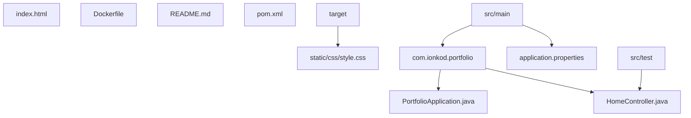

---

# IonKod Portfolio

Este é o projeto de portfólio pessoal do desenvolvedor Douglas Lucio, criado com Java e Spring Boot. O objetivo deste projeto é apresentar as habilidades técnicas, experiências profissionais e projetos desenvolvidos. O portfólio foi desenhado para ser moderno, responsivo e funcional, destacando o que Douglas pode oferecer como Full-Stack Developer.

## Funcionalidades

- **Página de Apresentação**: Uma visão geral sobre o desenvolvedor, com uma breve descrição e habilidades principais.
- **Seção de Projetos**: Apresenta projetos anteriores desenvolvidos por Douglas Lucio, com descrições e tecnologias utilizadas.
- **Experiência Profissional**: Um histórico das experiências de trabalho do desenvolvedor.
- **Design Responsivo**: Interface que se adapta a diferentes dispositivos, como desktops, tablets e smartphones.

## Tecnologias Utilizadas

- **Java**: Linguagem principal para o desenvolvimento backend.
- **Spring Boot**: Framework para criação de aplicações web robustas e escaláveis.
- **HTML5 e CSS3**: Tecnologias para construção da interface do usuário.
- **JavaScript**: Utilizado para interatividade na página.
- **Thymeleaf**: Template engine para renderizar páginas HTML no lado do servidor.
- **Maven**: Gerenciador de dependências e automação de build.
- **Docker**: Para containerização da aplicação, facilitando o deploy em diferentes ambientes.

## Estrutura do Projeto



## Estrutura de Diretórios

```markdown
├── src
│   ├── main
│   │   ├── java
│   │   │   └── com
│   │   │       └── ionkod
│   │   │           └── portfolio
│   │   │               ├── HomeController.java
│   │   │               └── PortfolioApplication.java
│   │   └── resources
│   │       ├── application.properties
│   │       ├── static
│   │       │   └── css
│   │       │       └── style.css
│   │       └── templates
│   │           ├── index.html
│   │           └── YAUH.jpg
│   └── test
│       └── java
│           └── com
│               └── ionkod
│                   └── portfolio
│                       └── PortfolioApplicationTests.java
├── Dockerfile
├── README.md
├── pom.xml
```

## Descrição dos Principais Arquivos

- **application.properties**: Configurações de ambiente da aplicação, como portas e banco de dados.
- **HomeController.java**: Controlador responsável por lidar com requisições HTTP e direcionar para as views adequadas.
- **PortfolioApplication.java**: Classe principal que inicializa o Spring Boot.
- **index.html**: Template da página principal do portfólio.
- **style.css**: Estilos CSS utilizados na personalização da interface do usuário.
- **Dockerfile**: Arquivo que descreve como a aplicação deve ser containerizada no Docker.
- **pom.xml**: Arquivo de configuração do Maven para gerenciar dependências e processos de build.

## Como Executar o Projeto

1. **Pré-requisitos**:
   - Java 17+
   - Maven
   - Docker (opcional para execução em contêiner)

2. **Passos para executar**:
   - Clone este repositório.
   - Execute `mvn clean install` para baixar as dependências e compilar o projeto.
   - Use `mvn spring-boot:run` para rodar a aplicação localmente.
   - Acesse `http://localhost:8080` no navegador.
   - link do site online no Render `https://www.ionkod.com`

## `Autor`

Douglas Lucio - [GitHub](https://github.com/dlucioyauh)

---

&copy; 2024 IonKod. Todos os direitos reservados.

---

